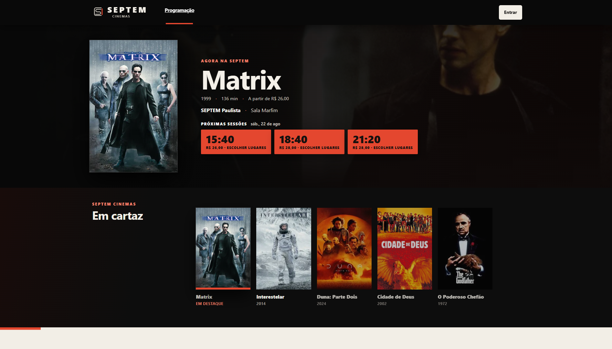
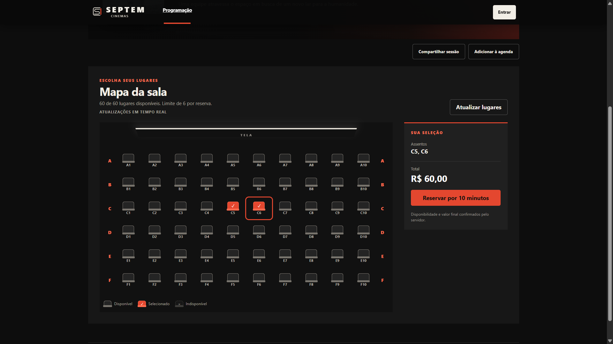
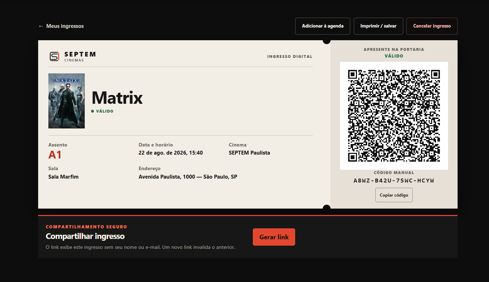
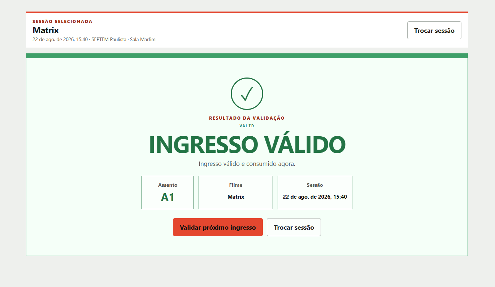
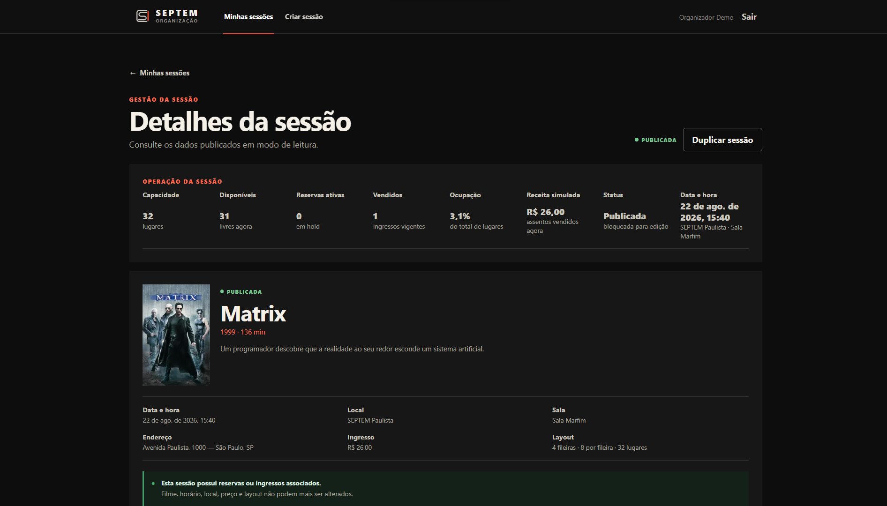

# SEPTEM Cinemas

**Cinema, do assento à portaria.**

[](https://github.com/daniel-moulaz/elite-dev-verzel/actions/workflows/ci.yml)

Plataforma de sessões de cinema construída para o desafio Elite Dev da Verzel. O organizador monta uma sessão a partir do catálogo da TMDb, o cliente escolhe o lugar em um mapa de assentos e paga de forma simulada, recebe um ingresso com QR assinado que pode compartilhar por link, e a portaria valida a entrada.

| Ambiente | URL |
|---|---|
| Aplicação | https://septem-cinemas.vercel.app |
| API | https://elite-dev-verzel-production.up.railway.app |
| Swagger UI | https://elite-dev-verzel-production.up.railway.app/docs |

## Demonstração

Todas as contas usam a senha `Demo@123`.

| Papel | E-mail | O que faz |
|---|---|---|
| Organizador | `organizer@demo.local` | Cria sessões a partir do catálogo, publica, edita, duplica e acompanha as métricas de cada sala |
| Cliente | `customer1@demo.local` | Navega pela programação, reserva assentos, paga e gerencia seus ingressos |
| Cliente | `customer2@demo.local` | Já possui um ingresso válido semeado, para testar a portaria sem precisar comprar |
| Portaria | `gate@demo.local` | Valida ingressos na entrada, por câmera ou código digitado |

A base semeada tem 14 sessões publicadas de 5 filmes em três datas futuras, 2 rascunhos e 1 ingresso válido. As datas são recalculadas a cada execução do seed, então a programação nunca aparece no passado.

## Avalie em 5 minutos

1. Abra a programação e escolha um horário. Os horários são o CTA: clicar em um deles leva direto ao mapa da sala.
2. Entre como `customer1@demo.local`, selecione um ou mais lugares e reserve. O hold dura 10 minutos e o contador fica visível.
3. No resumo, use **Aprovar pagamento** para emitir o ingresso ou **Recusar pagamento** para devolver os lugares ao mapa.
4. Em **Meus ingressos**, abra o ingresso emitido. Ele traz o QR, o código manual, adicionar à agenda, impressão e o link de compartilhamento sem dados pessoais.
5. Entre como `gate@demo.local` em outra janela e valide o ingresso de `customer2@demo.local` (Matrix, assento A1). Apresente-o na sessão errada para ver `WRONG_EVENT`, depois na sessão certa para `VALID`, repita para `ALREADY_USED` e digite qualquer texto para `INVALID`.
6. Entre como `organizer@demo.local`. A sessão de Matrix das 15:40 tem uma compra paga: o painel mostra ocupação e receita, e a edição está bloqueada. Qualquer outra sessão publicada continua editável.

Para ver o tempo real, abra a mesma sessão em duas janelas com clientes diferentes: quando um reserva, o lugar some no mapa do outro sem recarregar.

## Screenshots


*Programação: pôster, backdrop e horários que iniciam a compra.*


*Mapa da sala, com estado de cada lugar também no texto, não apenas na cor.*


*Ingresso digital: QR assinado e código manual como credenciais alternativas.*


*Portaria: resultado grande e inequívoco, legível a distância.*


*Organizador: capacidade, disponíveis, hold, vendidos, ocupação e receita simulada.*

## Funcionalidades

**Cliente**
Programação pública com busca por filme ou cinema e filtros por data e local. Detalhe da sessão com mapa de assentos, atualizado em tempo real. Reserva de até seis lugares com hold de 10 minutos. Checkout com pagamento simulado aprovado ou recusado. Ingresso digital com QR e código manual, adicionar à agenda, impressão e link de compartilhamento. Cancelamento de um ingresso individual ou da compra inteira, com os lugares voltando ao mapa.

**Organizador**
Criação de sessão a partir do catálogo da TMDb, com rascunho e publicação. Edição de sessão publicada enquanto a alteração for segura. Duplicação de uma sessão como novo rascunho, copiando apenas a estrutura. Painel operacional por sessão com capacidade, disponíveis, reservas em hold, vendidos, ocupação e receita simulada.

**Portaria**
Leitura do QR pela câmera, com digitação do código manual sempre disponível como alternativa. Quatro resultados distintos: `VALID`, `ALREADY_USED`, `WRONG_EVENT` e `INVALID`.

A lista completa de endpoints está no [Swagger](https://elite-dev-verzel-production.up.railway.app/docs).

## Decisões técnicas que importam

O raciocínio completo, com as alternativas que foram descartadas, está em [`docs/DECISIONS.md`](docs/DECISIONS.md). O resumo:

### Concorrência e double booking

O PostgreSQL é a autoridade sobre quem ficou com o lugar, não o frontend nem a camada de aplicação. Uma alocação de assento nunca é apagada: ela ganha um `releasedAt` quando o hold expira, o pagamento é recusado ou a compra é cancelada. Um índice único parcial garante que exista no máximo uma alocação **ativa** por assento, de modo que duas compras simultâneas do mesmo lugar não podem coexistir mesmo com várias instâncias da API. As transações que disputam assentos adquirem locks em uma ordem global fixa, o que evita deadlock entre reserva, pagamento, cancelamento e portaria.

O ganho de preservar o histórico é que pagamento, ingresso e auditoria continuam existindo depois de um cancelamento. O custo é que toda consulta de disponibilidade precisa filtrar explicitamente as alocações ativas.

### Ingresso e portaria

O QR carrega um token assinado com HMAC-SHA256 e claims mínimos: identificador do ingresso, sessão e expiração derivada do horário da exibição. O algoritmo é fixado na verificação e a comparação da assinatura é feita em tempo constante. Forjar um ingresso exigiria o segredo de assinatura, que nunca sai do backend. O código manual existe como credencial alternativa quando a câmera falha, com 16 caracteres de um alfabeto sem ambiguidade visual.

O consumo é atômico: a portaria executa uma atualização condicionada ao ingresso ainda estar válido. Se dois dispositivos apresentarem o mesmo ingresso ao mesmo tempo, apenas um recebe `VALID`; o outro relê o estado e recebe `ALREADY_USED`. Um ingresso cancelado nunca é aceito.

### Tempo real

O PostgreSQL continua sendo a fonte da verdade. O canal SSE em `GET /sessions/:id/events` transporta apenas um sinal de invalidação com o identificador da sessão, nunca o estado dos assentos. Ao receber o sinal, o navegador refaz a consulta do mapa, que é o snapshot autoritativo. Os eventos só são publicados depois do commit da transação correspondente.

O polling continua ativo como rede de segurança: perder um evento atrasa a atualização, mas nunca produz estado incorreto. O broadcaster é em memória e vale para uma instância da API, o que é adequado ao deploy single-instance deste desafio. Com múltiplas réplicas, invalidações não cruzam processos e a atualização volta a depender do polling.

### Cancelamento

São duas operações distintas. O cancelamento individual libera apenas o assento daquele ingresso e mantém a compra ativa enquanto restar ao menos um ingresso válido. O cancelamento integral encerra a compra e devolve todos os lugares ainda canceláveis. Nos dois casos, os lugares voltam ao mapa imediatamente e podem ser comprados por outro cliente.

Um ingresso já utilizado nunca é cancelado, e o cancelamento só vale antes do início da sessão. O pagamento aprovado permanece registrado como histórico da simulação: não existe integração de estorno, e isso é intencional.

### Edição segura de sessão publicada

Publicar não congela a sessão. Enquanto não houver consequência comercial e a sessão não tiver começado, filme, data, local, sala, preço e mapa continuam editáveis, e a sessão segue publicada. A edição é bloqueada quando existe uma reserva em andamento, quando já há ingressos vendidos ou quando o horário de início passou. A interface mostra qual desses é o motivo, em vez de um bloqueio genérico.

O mapa de assentos tem uma restrição própria: se algum lugar da sessão já foi reservado alguma vez, refazer o mapa apagaria esse histórico, então apenas esse campo fica travado enquanto os demais continuam editáveis.

### Segurança

- Autenticação por JWT com três papéis, sempre reavaliados no backend a partir do usuário no banco, nunca do que o token afirma.
- Senhas apenas como hash Argon2id. Um login com e-mail inexistente verifica um hash descartável, para que o tempo de resposta não revele quais contas existem.
- Recursos de outro cliente respondem `404`, e não `403`, para não confirmar que existem.
- QR assinado, com o segredo restrito ao backend.
- Link de compartilhamento com token aleatório de 32 bytes; o banco guarda apenas o hash SHA-256, e a página pública não expõe nome, e-mail nem identificador do dono.
- Cabeçalhos `X-Content-Type-Options`, `Referrer-Policy` e `X-Frame-Options` em todas as respostas, inclusive no stream SSE.
- Limite de tentativas de login **por origem, nunca por conta**: a conta não entra na chave justamente para que ninguém consiga tornar uma conta indisponível de propósito. O limite protege a CPU do servidor contra um cliente abusivo; não é uma defesa contra adivinhação das contas de demonstração, cujas senhas estão neste README. O estado é em memória e vale por processo, sem coordenação entre réplicas.
- `TRUST_PROXY` precisa ser ligado quando a API roda atrás de um proxy, para que a origem considerada seja o cliente real e não o proxy.

## Stack

**Frontend:** React, TypeScript e Vite, sem framework de UI nem biblioteca de CSS. QR gerado com `qrcode.react` e lido com ZXing.

**Backend:** Node.js, TypeScript e Fastify, com validação por Zod, JWT para autenticação e Argon2id para senhas.

**Banco:** PostgreSQL com Prisma.

**Apoio:** Vitest, OpenAPI com Swagger UI, Docker Compose, GitHub Actions e TMDb como catálogo de filmes.

## Testes

191 testes em 18 arquivos, executados contra um PostgreSQL real. A suíte cobre os fluxos de ponta a ponta e também os invariantes críticos: reserva concorrente do mesmo assento, corrida entre cancelamento e portaria, consumo simultâneo do mesmo ingresso, expiração de hold decidida pelo relógio do banco e rollback de transação. Os testes de concorrência usam barreiras reais de lock, não esperas por tempo. A cobertura não foi medida.

```bash
npm test
```

## Execução local

Requer Node.js 22.12 ou superior (ou Node.js 24), npm e Docker com Docker Compose.

```bash
cp .env.example .env
npm ci
npm run db:up
npm run db:migrate:deploy
npm run db:seed
npm run dev
```

No PowerShell, use `Copy-Item .env.example .env`.

O frontend sobe em `http://localhost:5173` e a API em `http://localhost:3333`, com a documentação em `http://localhost:3333/docs`.

Sobre as variáveis do `.env`:

- `TMDB_READ_ACCESS_TOKEN` é o **API Read Access Token** obtido nas [configurações de API da TMDb](https://www.themoviedb.org/settings/api). Ele é necessário apenas para o organizador buscar filmes; as sessões já criadas usam um snapshot local e não dependem da TMDb para leitura.
- `JWT_SECRET` e `TICKET_SIGNING_SECRET` precisam ser strings aleatórias diferentes, com pelo menos 32 caracteres cada.
- `WEB_ORIGIN` restringe o CORS da API e `VITE_API_URL` aponta o frontend para ela.
- Nenhum desses valores deve ganhar o prefixo `VITE_`, que os exporia no navegador.

Para parar o banco preservando os dados, use `npm run db:stop`. Verificações completas: `npm run check`.

## Deploy

O frontend está publicado na Vercel e a API com PostgreSQL no Railway. A API é construída a partir da raiz do monorepo com Railpack, respeita a `PORT` da plataforma e expõe `/health` para o healthcheck do rollout. As migrations são aplicadas no fluxo de produção: `railway.json` declara `npm run db:migrate:deploy` como comando de pre-deploy. O seed é uma operação única e manual, porque executá-lo a cada restart restauraria datas, senhas e o estado do ingresso de demonstração.

A versão publicada corresponde ao último push, e não necessariamente ao estado atual deste repositório.

## Documentação

| Documento | Responde |
|---|---|
| [`docs/DECISIONS.md`](docs/DECISIONS.md) | Por que é assim. Registro das decisões de arquitetura, com contexto, alternativas descartadas e trade-offs. Decisões substituídas foram marcadas como superadas, não apagadas. |
| [`docs/ARCHITECTURE.md`](docs/ARCHITECTURE.md) | Como está montado. Camadas, modelo de dados, ordem global de locks, contrato das rotas e limitações conhecidas. |
| [`docs/REQUIREMENTS.md`](docs/REQUIREMENTS.md) | O que estava no escopo. Requisitos do desafio, o que foi implementado e o que ficou deliberadamente de fora. |
| [`docs/AI-USAGE.md`](docs/AI-USAGE.md) | Como a IA foi usada, milestone a milestone. |

## Uso de IA

Este projeto foi construído com apoio de IA em planejamento, implementação, revisão de código, testes e documentação. As decisões de produto e de arquitetura foram tomadas e revisadas por mim, e os fluxos críticos foram validados manualmente e cobertos por testes automatizados. Em várias etapas, propostas da ferramenta foram rejeitadas ou refeitas depois da revisão.

O registro detalhado está em [`docs/AI-USAGE.md`](docs/AI-USAGE.md): o que foi direção humana, o que a ferramenta produziu, o que foi descartado e como cada etapa foi verificada.

## TMDb

Este produto usa a API da TMDb, mas não é endossado nem certificado pela TMDb. A SEPTEM não tem qualquer afiliação com a TMDb. Pôsteres, backdrops, sinopses e metadados dos filmes pertencem a seus detentores de direitos.
